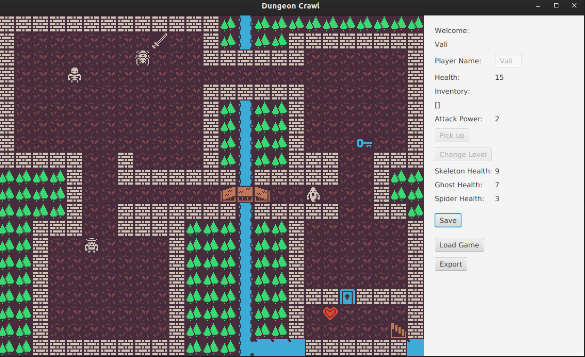
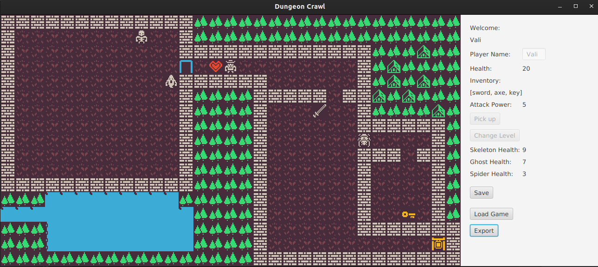
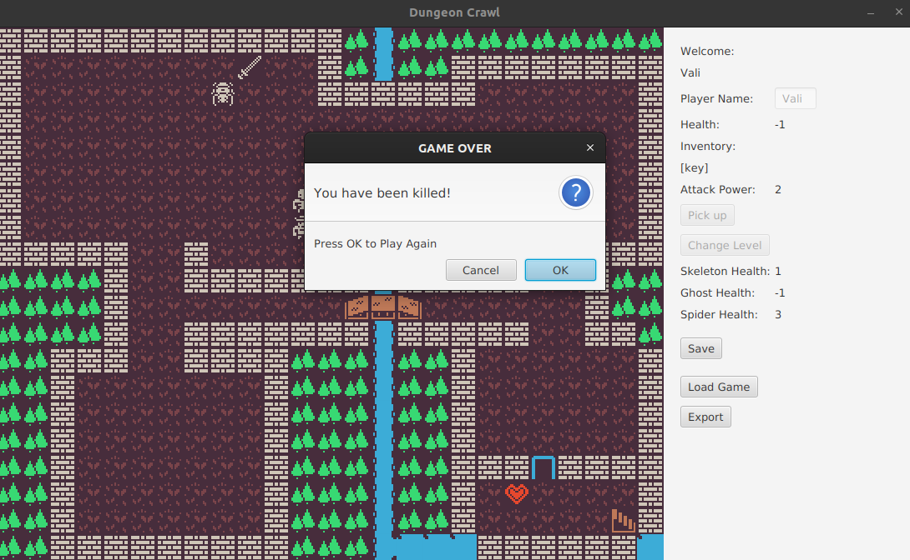
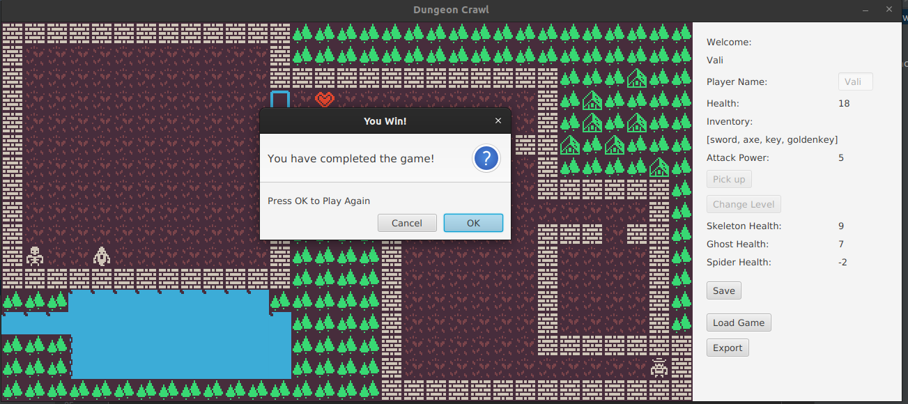

# Dungeon Crawl 

## Introduction
Roguelikes are one of the oldest types of video games, the earliest ones were made in the 70s, they were inspired a lot by tabletop RPGs.

RogueLikes usually have the following characteristics:

- It is tile-based.
- Usually the task is to explore a labyrinth and exit alive.
- If you die the game is over and you have to start over from the beginning.

## About the game

The game presents our hero in his attempt to leave a dangerous dungeon.
He encounters powerful enemies like spiders, skeletons, even ghosts!
The game has two levels with two different maps and different items on them.
First Level:

Second Level:

The hero can pick up items like swords and axes to improve his stats and his attack strength.

When he reaches a door and he has the key, the doors open and with the ‘Next Level’ Button goes to the second map (Second level).

Skeletons and ghosts move randomly on the map and the hero has to go around them or fight them.

You can choose a name for your player in the right side of the window.

There are information fields about the health of the player, his attack strength and a inventory where we can see all the items he picks up with the help of the ‘Pick Up’ Button.

The enemies also harm our hero and he can die if he doesn’t get the health potion
on time.

The goal for him today is the "golden gate" from the 2nd floor.Once the hero gets to the "golden gate" and has the "golden key" in inventory the game is complete.

## Technologies used for this project

- JavaFx
- Maven
